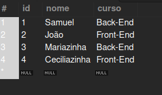

## 📖  Introdução a banco de dados

A vida dos programadores é repleta de dados. Esses dados precisam estar armazenados e organizados para que nossas aplicações funcionem em perfeita sincronia. 

---

Um banco de dados é como uma **grande coleção organizada de informações que são armazenadas eletronicamente em um computador**. Pense nele como um arquivo gigante onde você pode armazenar dados de forma estruturada para que possam ser facilmente acessados, gerenciados e atualizados. Esses dados podem ser qualquer coisa, desde nomes de pessoas e números de telefone até registros de vendas em uma loja ou informações sobre produtos em um site. O banco de dados ajuda a manter essas informações **organizadas** e **seguras**, permitindo que você faça coisas como pesquisar por dados específicos, adicionar novos dados, atualizar informações existentes e muito mais, tudo de forma eficiente e confiável.

## 📚 SGBD - Sistema de Gerenciamento de Banco de Dados

Um **SGDB, ou Sistema de Gerenciamento de Banco de Dados**, é um **software** que ajuda a criar, manter e acessar bancos de dados. 

- **Armazenamento de Dados:** Os SGBDs permitem armazenar grandes volumes de dados de forma estruturada e organizada.

- **Acesso aos Dados:** Eles fornecem mecanismos para recuperar e manipular os dados armazenados de maneira eficiente.

- **Gerenciamento de Dados:** Os SGBDs ajudam a garantir a integridade e a segurança dos dados, gerenciando permissões de acesso e garantindo que as informações estejam consistentes.

- **Linguagem de Consulta:** Eles oferecem uma linguagem de consulta (como SQL - Structured Query Language) para realizar operações como inserção, atualização, exclusão e seleção de dados.

- **Concorrência e Transações:** Os SGBDs são projetados para lidar com múltiplos usuários acessando e modificando os dados simultaneamente, garantindo que as transações sejam executadas de forma consistente e isolada.

- **Backup e Recuperação:** Eles fornecem recursos para fazer backup regular dos dados e restaurá-los em caso de falhas de hardware ou erros humanos.

Existem diferentes tipos de SGBDs, incluindo os **relacionais** (como MySQL, PostgreSQL, Oracle) que organizam os dados em tabelas relacionadas, e os **não relacionais** (como MongoDB, Cassandra) que armazenam os dados de forma mais flexível, geralmente em formato de documentos ou pares de chave-valor. **Cada tipo de SGBD tem suas próprias vantagens e é adequado para diferentes cenários de aplicação.**

## 📚 Banco de dados Relacional

São baseados no modelo relacional, uma maneira direta e intuitiva de representar dados em uma tabela. Em um BD Relacional, cada linha na tabela é um registro com um **Chave**. As colunas da tabela contêm atributos e cada registro tem um valor

### Exemplo ↘️

>Na imagem acima temos um exemplo de uma tabela com um id, nome e curso de um aluno

Com a organização de linhas e colunas temos os dados que formam uma tabela. Os dados geralmente são estruturados em várias tabelas, que podem ser unidas por meio de **Chave Primária ou Estrangeira.** 

## 📚 Linguagem SQL

A linguagem SQL (Linguagem de consulta estruturada) é a linguagem padrão para interagir com os sistemas de gerenciamento de banco de dados relacional, permitindo ações como adicionar, atualizar, recuperar e excluir linhas de dados. O SQL está dividido em algumas categorias de instruções: 

- **DML - Linguagem de Manipulação de dados:** Indicando uma ação que será executada em nosso banco de dados. Utilizados para recuperação, inserção e modificação de registros. Temos entre eles os principais comandos: **INSERT, DELETE, UPDATE E SELECT**
- **DDL - Linguagem de Definição de Dados:** São responsávei pela criação, alteração e exclusão de Objetos no Banco de Dados, ou seja, pela sua estrutura (tabelas). Seus principais comandos: **CREATE, ALTER E DROP**
   

---
## 📚 Introdução ao Banco de Dados não Relacional

Esse bancos são softwares que armazenam os dados de maneira diferente aos Bancos SQL (Relacionais). Não usam tabelas, mas alguns outros esquemas de armazenamento. Também não tem a Linguagem SQL como padrão. Cada banco desse tem uma linguagem própria. Algumas parecidas com o SQL nos fundamentos e sintaxes, mas ainda são diferentes

4 Tipos de Armazenamento para os bancos de dados não Relacionais.

- #### Banco da Dados de Documentos: 
    Armazenam e consultam os dados em forma de documentos, geralmente utilizando formato JSON ou BSON
    

- #### Banco de dados de Colunas:
  Armazenam os dados em colunas, em vez de linhas (Semelhante aos Relacionais), permitindo uma recuperação eficiente em conjuntos especifícos de colunas

- #### Banco de dados de Grafos:
  Modelam os dados como grafos, compostos por nós, arestas e propriedades.
  São eficientes para consultas que envolvem relações complexas e interconexão entre os dados

- #### Banco de dados de Chave-Valor:
  Armazenam por Chave-Valor, onde cada chave está associada a um único valor. 
  São altamente escaláveis e oferecem recuperação rápida de dados, ideal para armazenamento em cachê e sessões de usuário