# 📑 DER - Diagrama Entidade Relacionamento
---

Um **Diagrama Entidade Relacionamento** é um fluxograma que mostra como as entidades se relacionam dentro de um sistema de Banco de dados Relacional.

é uma representação visual de toda **entidade**, **atributo** e **relacionamento**.

 - **Entidades = tabelas**: Cada tabela é representada como uma entidade no DER e são representadas por um retangulo contendo o nome da tabela
  
  
 
  

 

- **Atributos = Campos:** São as caracteristicas ou propriedades das entidades. São representadas como uma lista de campos contendo seu nome e o tipo de dado.

 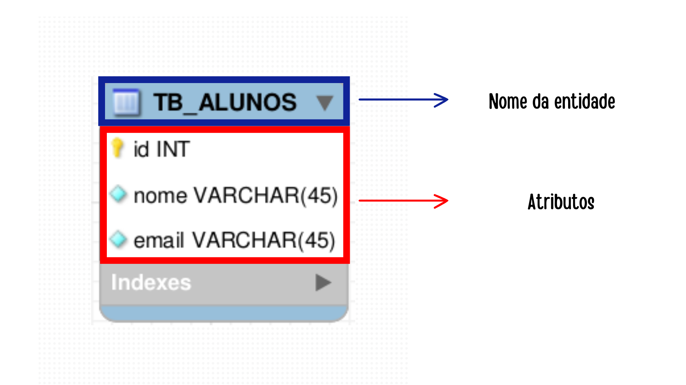
  

- **Relacionamentos:** São representados por linhas que conectam as entidades e definem a cardinalidade (quantidade de registros de outra tabela.)

## Tipos de Cardinalidade em Bancos de Dados

| Tipo de Cardinalidade | Descrição |
|-----------------------|-----------|
| 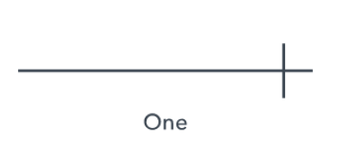                | Indica um relacionamento onde um único registro em uma tabela está associado a apenas um único registro em outra tabela, e vice-versa. |
| 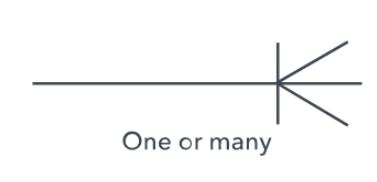           | Indica um relacionamento onde um único registro em uma tabela pode estar associado a um ou mais registros em outra tabela, mas cada registro na segunda tabela está associado a apenas um registro na primeira tabela. |
| 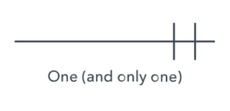     | É o oposto de 1:N, indicando que vários registros em uma tabela podem estar associados a apenas um único registro em outra tabela, mas cada registro na primeira tabela está associado a apenas um registro na segunda tabela. |
| 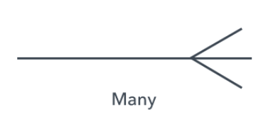                | Indica um relacionamento muitos para muitos, onde vários registros em uma tabela podem estar associados a vários registros em outra tabela e vice-versa. Isso geralmente é implementado usando uma tabela de junção. |

- ### Exemplo ↘️
  
  
 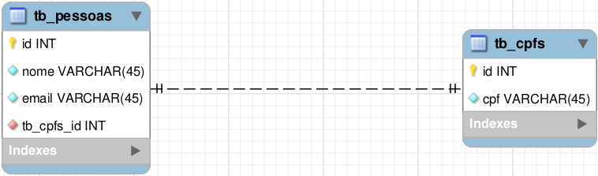
  

  >Na imagem temos o relacionamento 1:1 (One-to-One). Onde uma pessoa só pode ter um cpf e um cpf só pode pertencer a uma pessoa

 

## :desktop_computer: Criando nosso Diagrama Entidade Relacionamento
---

- Abra o MySQL Workbench
  
  
 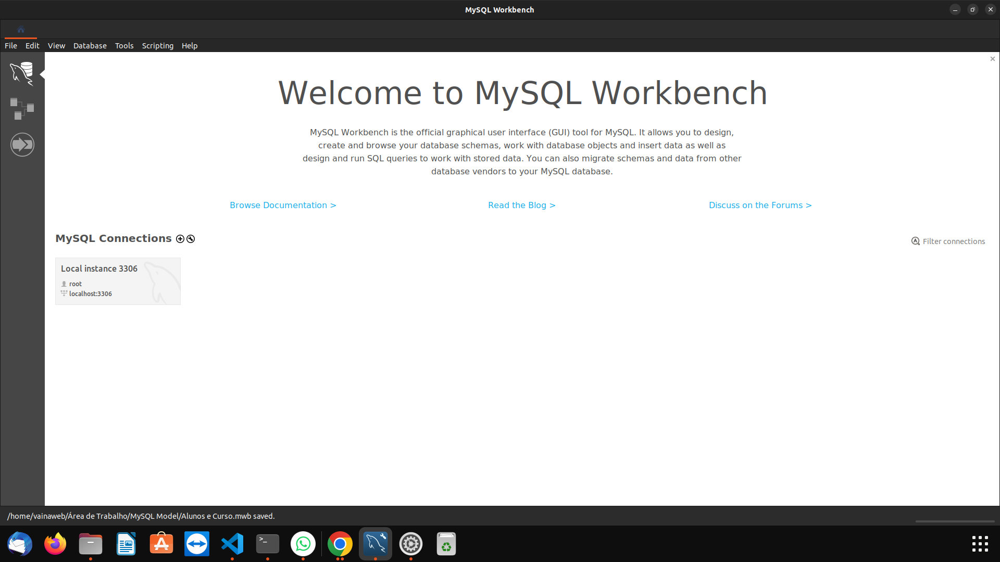
  

 

- No canto superior esquerdo procure pela opção *Models*
  
 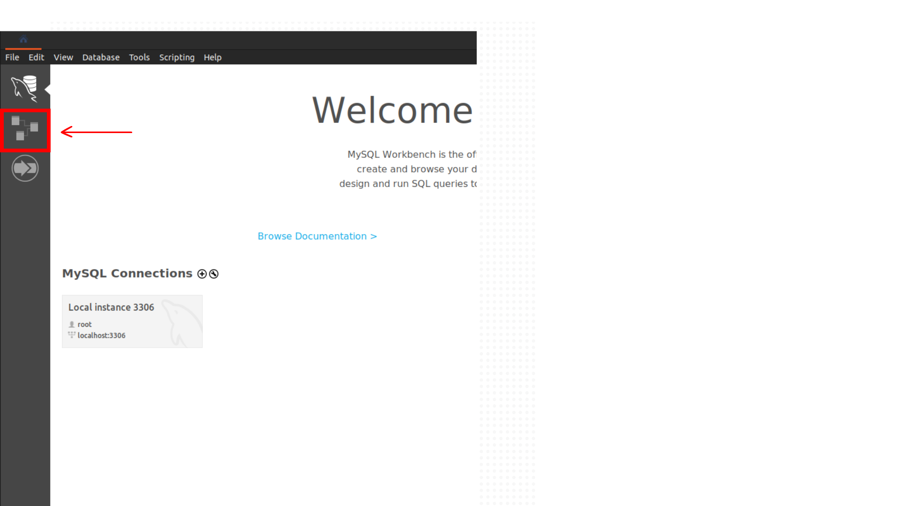
  

   

- Procure o **Circulo com o +** para criar um novo modelo
  
 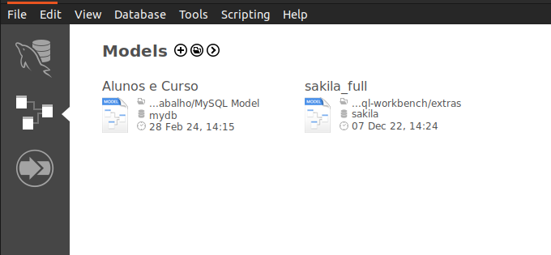
  

   

- Ao abrir a guia, clique duas vezes sobre o mydb para alterar o nome do nosso banco de dados
  
 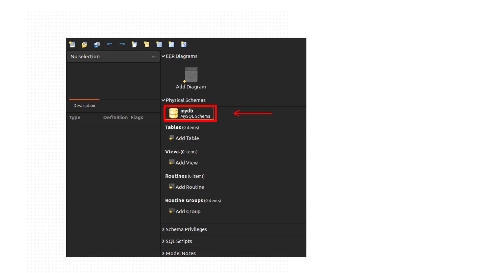

     

- Troque o nome para o desejado
  
 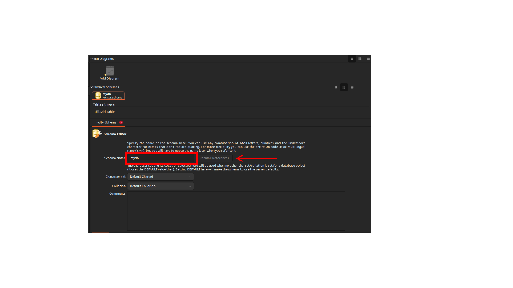

   

- Após isso, clique em **Add Diagram**
  
 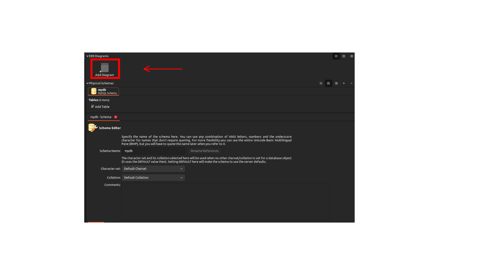

     

- Vamos nos deparar com essa aba
  
 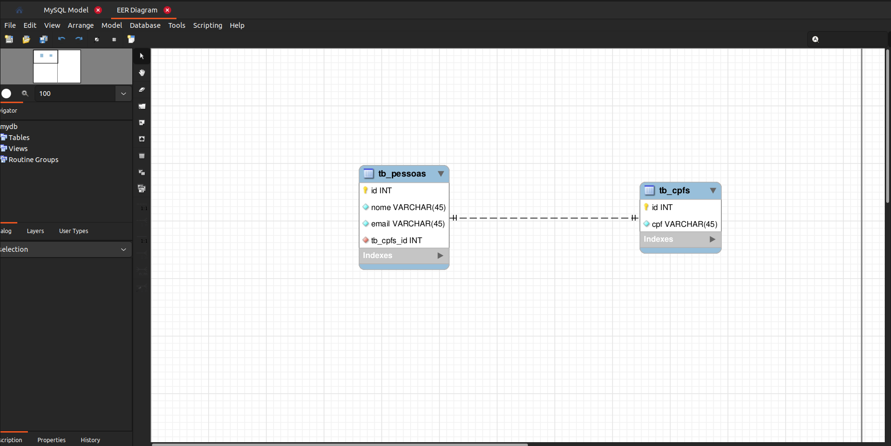

> As duas entidades presentes não irão aparecer no momento da criação
---
##### ⚠️ No momento da criação desses arquivos, estaremos visualizando a partir da distribuição Ubuntu do Linux. Aqueles que utilizam alguma outra versão ou algum outro SO, como Windows, podem notar algumas diferenças de visualização.
---