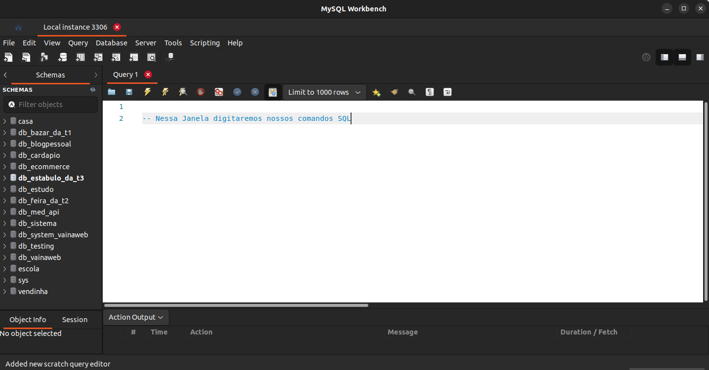
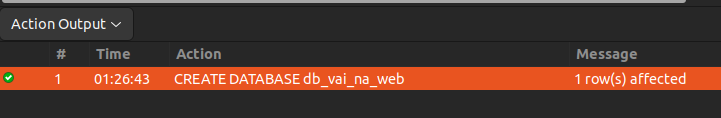
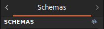

# :books: Parte 01 - Comandos SQL

Nesse documento iremos introduzir os primeiros passos com os comandos SQL e criando um banco de dados


### :hammer_and_wrench: Criação 
- Com o MySQL Workbench aberto, precisamos conectar com o Server. Clique na conexão:
 <Br>


<br>

 - Clique duas vezes 
 - Solicitada a senha do usuário, digite a senha que foi cadastrada na configuração e marque a opção Save password in vault, para gravar a senha e não solicitar novamente
  
<br>

- Com a conexão bem sucedida, nos deparamos com a janela principal do **MySQL Workbench**, onde vamos escrever todas as instruções


---

### 🌩️ Executando consultas
- Vamos utilizar a Guia Query para escrever todos os códigos


- para executarmos uma Query, vamos clicar na barra de ferramentas as opções abaixo
  
| Imagem | Descrição                                        |
|----------------|--------------------------------------------------|
|    | Executa a linha onde o cursor está posicionado                |
|  | Executa todas as linhas presentes na guia Query     |

## Criando o primeiro banco de dados

Vamos então dar inicio a jornada do banco de dados. Para isso, vamos utilizar o primeiro comando na nossa aba **Query**

```SQL
CREATE DATABASE db_vai_na_web;
```

Esse é um comando do tipo **DDL (Data Definition Language)**, utilizado para criar um Banco de Dados

Ao executar, temos uma mensagem em uma janela que indica se a Query foi executada com sucesso ou não. Se o banco de dados for criado teremos uma mensagem informando como na imagem abaixo: 



Para visualização do banco de dados criado, Na janela Navigator, no lado esquerdo, clicaremos no botão Refresh.



>Clicando nas duas setas atualizamos a nossa lista de SCHEMAS

O banco de dados aparecerá na lista de **SCHEMAS**

## Usando o Banco de Dados
Antes de criarmos as primeiras tabelas, é necessário indicar ao MySQL em qual banco a tabela será criada e para isso iremos utilzar a Query:

```SQL
USE db_vai_na_web;
``` 
> A instrução USE é usada para entrar no banco de dados.

Próximo passo é a verificação da mensagem no OUTPUT. 


Com o banco selecionado vamos executar todos os comandos.

## Criando a primeira tabela

Para a criação, iremos utilizar a Query

```SQL
CREATE TABLE tb_colaboradores(
    id BIGINT AUTO_INCREMENT PRIMARY KEY,
    nome VARCHAR(255) NOT NULL,
    documento VARCHAR(20) NOT NULL UNIQUE,
    cargo VARCHAR(50) NOT NULL
);
```
 **CREATE TABLE** **nome_da_tabela ();** para a criação. Nessa mesma instrução vamos incluir as colunas, com seus tipos de dados e suas constraints.

 Abaixo temos os **tipos de dados** e algumas **constraints** no MySQL:
 | Tipo de Dado   | Descrição                                        |
|----------------|--------------------------------------------------|
| **INT**        | Número inteiro de tamanho padrão                 |
| **VARCHAR(n)** | String de caracteres de comprimento variável     |
| **CHAR(n)**    | String de caracteres de tamanho fixo             |
| **TEXT**       | String de caracteres de comprimento variável     |
| **DATE**       | Data no formato 'YYYY-MM-DD'                     |
| **DATETIME**   | Data e hora no formato 'YYYY-MM-DD HH:MM:SS'     |
| **TIMESTAMP**  | Data e hora no formato 'YYYY-MM-DD HH:MM:SS'     |
| **FLOAT**      | Número de ponto flutuante                        |
| **DOUBLE**     | Número de ponto flutuante de precisão dupla      |
| **DECIMAL(p, s)** | Número decimal com precisão e escala especificadas |
| **BOOLEAN**    | Valor booleano (0 para false, 1 para true)       |
| **ENUM('val1', 'val2', ...)** | Lista de valores enumerados            |
---
<br>

### **Constraints**:
| Constraint          | Descrição                                             |
|---------------------|-------------------------------------------------------|
| **PRIMARY KEY**     | Identifica exclusivamente cada registro em uma tabela |
| **FOREIGN KEY**     | Estabelece uma relação entre duas tabelas            |
| **UNIQUE**          | Garante que todos os valores em uma coluna sejam únicos |
| **NOT NULL**        | Garante que uma coluna não aceite valores nulos      |
| **CHECK**           | Garante que os valores em uma coluna atendam a uma condição específica |
| **DEFAULT**         | Define um valor padrão para uma coluna               |

---

## Inserção de valores

Para a inserção de valores temos a estrutura

`INSERT INTO nome_da_tabela(Campos a serem adicionados) VALUES (Valores)`

Para a nossa tabela temos

```SQL
INSERT INTO tb_colaboradores(nome, documento, cargo) VALUES('Samuel', '111.222.333-44', 'INSTRUTOR');
INSERT INTO tb_colaboradores(nome, documento, cargo) VALUES('João Pedro', '222.111.444-12', 'INSTRUTOR');
INSERT INTO tb_colaboradores(nome, documento, cargo) VALUES('Karynne', '555.222.111-90', 'INSTRUTORA');
INSERT INTO tb_colaboradores(nome, documento, cargo) VALUES('Joy', '999.777.333-45', 'COORDENAÇÃO');
INSERT INTO tb_colaboradores(nome, documento, cargo) VALUES('Dandara', '888.667.333-19', 'COORDENAÇÃO');
```
> Não é preciso colocar id, já que temos a CONSTRAINT AUTO_INCREMENT que indica que o id será colocado de maneira automárica e sequêncial

---

## Seleção dados

Chegou a hora de fazermos as consultas. Nesse momento selecionamos quais dados serão retornados e também aplicaremos algumas clausulas com filtragens, ordenações e etc..

` SELECT campos_desejados FROM nome_da_tabela;`
```SQL
SELECT * FROM tb_colaboradores;
```
Resultado:


>Com o `*` selecionamos todas as colunas presentes nessa tabela. Mas pode ser feito com os dados que deseja consultar, como nome e documento, por exemplo.  

#### Cláusula WHERE
 A partir dessa clausula, conseguimos fazer uma filtragem.

```SQL
SELECT * FROM tb_colaboradores WHERE cargo = 'INSTRUTOR';
```
O resultado da consulta são os dados dos instrutores do vai na web. 


---

## Atualizando dados

Para trabalharmos com atualização seguimos a seguinte sintaxe
` UPDATE tabela SET campo = valor_inserido WHERE id = id_selecionado;`

```sql
UPDATE tb_colaboradores SET nome = 'Samuel Silverio' WHERE id = 1;
```
>Atualizando o nome de Samuel para Samuel Silverio

---

## Deletando dados

Para a deleção é bem importante estar atento ao id. Também é importante a verificação da cláusula WHERE. No geral, o Workbench aparece com as configurações de segurança para que nenhum DELETE sem WHERE seja feito, mas mesmo assim, é bom **SEMPRE** estar atento

`DELETE FROM tabela_selecionada WHERE id = id_selecionado;`

```SQL
DELETE FROM tb_colaboradores WHERE id = 1;
```
> A linha com as informações de Samuel Silvério será deletada