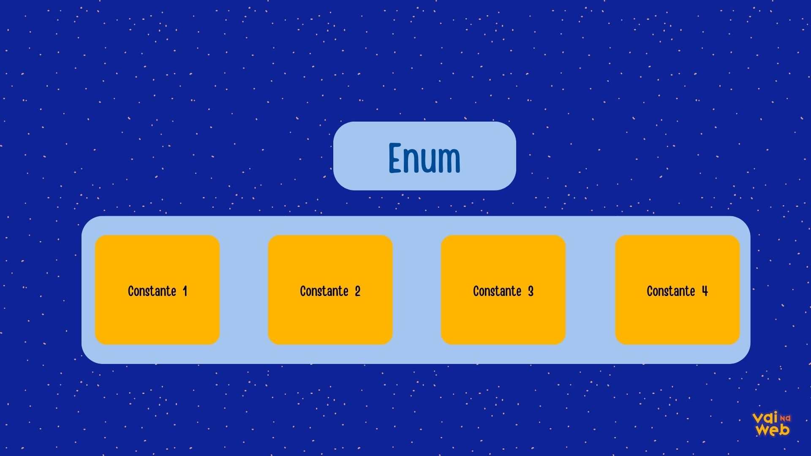

# Enumerações 

Os tipos enumeradores **enum** são palavras reservadas muito importantes no definição de constantes. Nós definimos as enumerações como classes especiais



``` java

public enum Level {
    FACIL,
    MEDIO,
    DIFICIL,
    MESTRE
}
```

>Acima temos um exemplo de enumeração que  vai definir o nível de um personagem

```java

public static void main(String[] args) {

    Level goomba = Level.FACIL;
    Level planta = Level.MEDIO;
    Level bowser = Level.DIFICIL;
    Level mario = Level.MESTRE;
}

```


>No código acima criamos 3 Boss. Ciclaninho, Fulaninho e Beltraninhol e determinamos os níveis de dificuldade para derrota-los

As enumerações são basicamente um grupo de **Atributos Constantes**. Usar enums torna o código mais fácil de **ler** e **manter**. Outro benefício é a segurança que proporcionam. Ao lidar com enums, torna-se praticamente impossível inserir valores que não existam ou que não estejam de acordo com o programa.

--- 
## Inserindo valores
Como são similares a constantes, há também a possibilidade de inserir valores para elas. Vamos atribuir uma frase pra cada personagem.

``` java

public enum Level {
    FACIL("É fácil derrotar esse personagem"),
    MEDIO("Não é tão fácil assim de derrotar esse personagem"),
    DIFICIL("Aos se encontrar com ele tem grandes chances de você perder"),
    MESTRE("Esse aqui é fera. Não da pra derrotar");
}
```


Ao fazer isso, temos a obrigação de criar um construtor para essa enum

``` java

public enum Level {
    FACIL("É fácil derrotar personagem"),
    MEDIO("Não é tão fácil assim de derrotar esse personagem"),
    DIFICIL("Ao se encontrar com ele tem grandes chances de você perder"),
    MESTRE("Esse aqui é fera. Não da pra derrotar");

    private String mensagem;

    Level(String mensagem){
        this.mensagem = mensagem;
    }

    public String getMensagem(){
        return mensagem;
    }
}
```
Através do método **getMensagem()** nós conseguimos ter acesso ao valor da constante.

> Importante lembrar que constantes são valores fixos que não podem ser mudados durante a execução.

--- 

Chamando na main: 

```java

public static void main(String[] args) {

    
    Level goomba = Level.FACIL;
    Level planta = Level.MEDIO;
    Level bowser = Level.DIFICIL;
    Level mario = Level.MESTRE;

    System.out.println(bowser.getMensagem());
}
```
no console seria impresso:

```Console
 Ao se encontrar com ele tem grandes chances de você perder
```

> Exemplo visual do programa
## Links auxiliares
- [Enums](https://www.devmedia.com.br/enumeracoes-em-java/25839)
