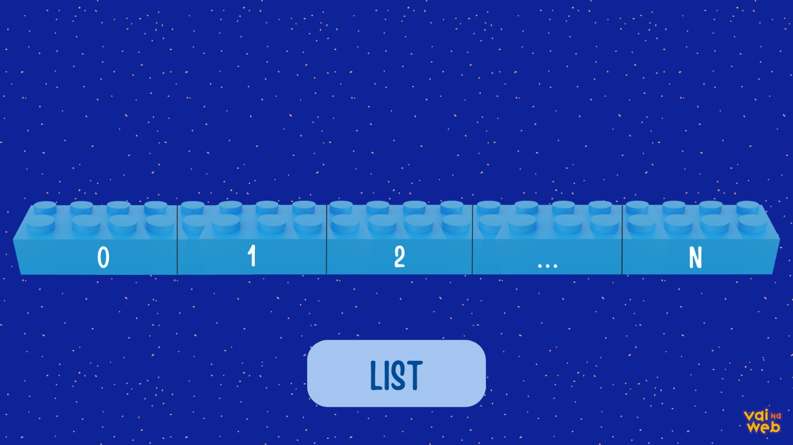
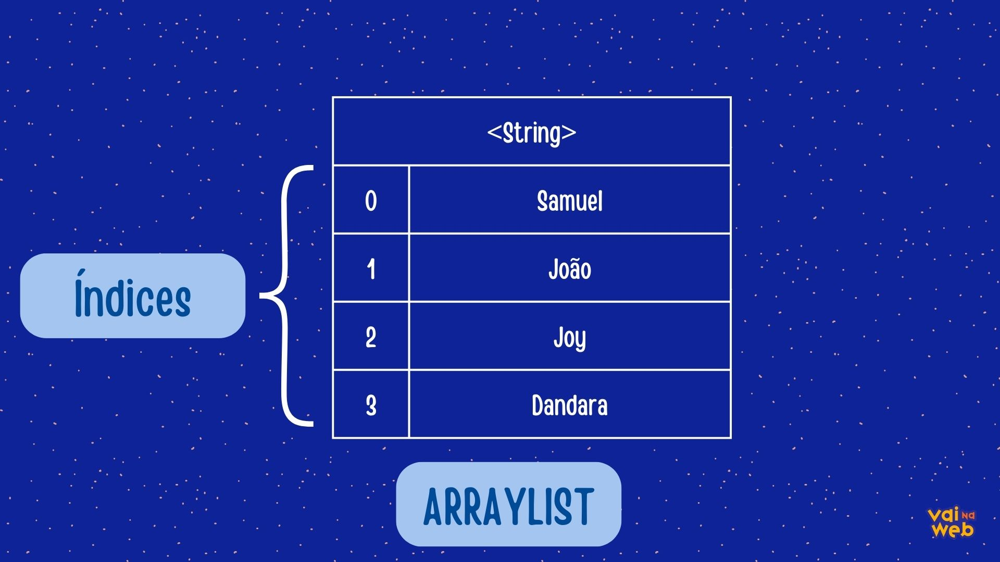

# Collections 

Em Java, as Collections (Coleções) são **estruturas de dados** que fornecem maneiras eficientes e convenientes de armazenar e manipular grupos de objetos. As Collections fazem parte do framework Collections Framework, que é uma parte fundamental da API Java para manipulação de dados.
É essencial que os desenvolvedores conheçam a API. Elas estão em todos os lugares.

<a></a>

Em seu core existem interfaces , as principais são:

| Nome| O que é |
|----------|----------|
| Collection | A interface raiz na hierarquia de coleções   |
| List  | Representa uma lista ordenada   |
| Set  | Representa um conjunto que não permite modificações   |
| Map  | Representa o mapeamento chave-valor   |
| Queue| Representa uma fila|

>Os nomes acima são suas implementações genéricas.  

Mais concretas:


|Nome | O que é |
|---------|------------|
|ArrayList|Implementação de uma lista redimensionável|
|LinkedList|Implementação de uma lista duplamente encadeada|
|HashSet|Implementação de um conjunto baseado em tabela de dispersão|
|TreeSet|Implementação de um conjunto ordenado|
|HashMap|Implementação de um mapa baseado em tabela de disperção|
|TreeMap|Implementação de um mapa ordenado|

### Iteração e Acesso aos Elementos
As coleções fornecem métodos para acessar e iterar sobre seus elementos. O loop *for-each* é frequentemente utilizado para percorrer coleções

Exemplo: 

```Java
List<String> nomes = new ArrayList<>();
nomes.add("Samuel");
nomes.add("João");
nomes.add("Joy");
nomes.add("Dandara");

for(String elemento: lista){
    System.out.println(elemento);
}
```
>Importante destacar que as Collection não aceitam tipos primitivos, apenas Wrapper Classes. *Notem que dentro do <>(diamante) tipamos a nossa ArrayList como String.* 

## Interface List
É uma extensão (herdando) da interface Collection. Como caracteristica tem os elementos ordenados como uma sequência. A interface é como uma array de tamanho varíavel, pois tem total controle sobre elementos inseridos nas lista, já que em sua utilização podemos acessar um determinado elemento através dos índices. 

<a></a>

>Fazendo uma analogia a blocos de montar

## Principais Caracteristicas: 
| |  |
|----------|----------|
| Ordenação | Os elementos em uma lista são mantidos em uma ordem específica.|
|Índices  | Cada elemento na lista é acessado por um índice inteiro, começando do zero. |
| Duplicatas | Permite a existência de elementos duplicados. |

## Métodos mais utilizados
| |  |
|----------|----------|
| add(elemento) | Adiciona um elemento ao final da lista.|
| remove(index)  |  Remove o elemento na posição específica da lista.|
| get(index): |  Retorna o elemento na posição especificada.|
| indexOf(element)|Retorna o índice da primeira ocorrência do elemento na lista.|
| size():|Retorna o número de elementos na lista.|


## Implementações conhecidas

| |  |
|----------|----------|
| ArrayList | Baseado em arrays dinâmicos, eficiente para acesso direto aos elementos|
| LinkedList | Implementação baseada em uma lista duplamente encadeada, eficiente para inserções e remoções no meio da lista |


## Array List

A implementação ArrayList é a escolha natural quando for necessário usar um vetor redimensionável, que é muito mais eficiente para leitura, por ser implementado internamente com vetores, o que a torna ideal para o acesso aleatório aos dados armazenados.

Segue abaixo um exemplo de sua utilização com uma lista de nomes. Eles serão tipas como String **(Lembrando que Collections não aceitam tipos primitivos)**:

```Java

public static void main(String[] args) {
		List<String> nomes = new ArrayList<>();
		nomes.add("Samuel");
		nomes.add("João");
		nomes.add("Joy");
		nomes.add("Dandara");
		
		//Percorrendo a lista
		for(String nome: nomes) {
			System.out.println(nome);
		}
		System.out.println("--------------------------------");
		
		// Removendo a primeira posição
		nomes.remove(0);
		
		//Acessando a primeira posição
		System.out.println(nomes.get(0));
		
		System.out.println("--------------------------------");
		
		//Pegando a posição do elemento
		System.out.println(nomes.indexOf("Joy"));
		
		System.out.println("--------------------------------");
		
		//Trazendo o tamanho da lista 
		System.out.println(nomes.size());
	}

```

### Saída no console

```Java
Samuel
João
Joy
Dandara
--------------------------------
João
--------------------------------
1
--------------------------------
3

```
>Como um ArrayList armazena os dados. Notem que tem uma grande semelhança com os vetores
<a></a>

## Linked List
LinkedList é uma lista duplamente encadeada, o que significa que cada elemento na lista é representado por um nó que contém uma referência para o próximo e o anterior na sequência.

<a></a>

```Java

// Criando uma lista encadeada
        List<String> nomes = new LinkedList<>();

        // Adicionando elementos à lista
        nomes.add("Samuel");
        nomes.add("João");
        nomes.add("Joy");
        nomes.add("Dandara");

        // Exibindo a lista
        System.out.println("Lista original: " + nomes);

        // Obtendo o elemento na posição 2 (índice 1)
        String elementoNaPosicao2 = nomes.get(1);
        System.out.println("Elemento na posição 2: " + elementoNaPosicao2);

        // Encontrando o índice do elemento "Joy"
        int indiceJoy = nomes.indexOf("Joy");
        System.out.println("Índice de 'Joy': " + indiceJoy);

        // Removendo o elemento "João"
        nomes.remove("João");
        System.out.println("Lista após remover 'João': " +  nomes);

        // Tamanho da lista após remoção
        int tamanhoLista =  nomes.size();
        System.out.println("Tamanho da lista: " + tamanhoLista);

        // Iterando pela lista
        System.out.println("Iteração:");
        for (String elemento :  nomes) {
            System.out.println(elemento);
        }

```
### Saída no console

```Java
Lista original: [Samuel, João, Joy, Dandara]
Elemento na posição 2: João
--------------------------------------------------------
Índice de 'Joy': 2
--------------------------------------------------------
Lista após remover 'João': [Samuel, Joy, Dandara]
--------------------------------------------------------
Tamanho da lista: 3
--------------------------------------------------------
Iteração:
Samuel
Joy
Dandara

```
>Como a implementação LinkedList armazena seus dados
<br>

## Interface SET
Repreenta uma coleção que não permite elementos duplicados, ou seja, muito utilizado quando o programador não quer que seu programa tenha elementos duplicados

## Principais Caracteristicas: 

| |  |
|----------|----------|
| Sem duplicatas | Não permite a inclusão de elementos duplicados. Cada elemento na coleção é único.|
|Sem Ordem Específica| Não mantém uma ordem específica dos elementos. A ordem de iteração pode não ser previsível. |

## Métodos Principais: 

| |  |
|----------|----------|
| add(elemento) | Adiciona um elemento à coleção, se não estiver presente|
| remove(index)  | Remove o elemento especificado da coleção, se presente.|
| contains(element)| Verifica se a coleção contém o elemento especificado.|
| iterator() |Retorna um iterador sobre os elementos na coleção.|
| size() |Retorna o número de elementos na coleção.|

## Implementações conhecidas

| |  |
|----------|----------|
| HashSet |Implementação baseada em tabelas de dispersão, sem garantia de ordem.|
| TreeSet | Implementação baseada em árvores, mantendo a ordem dos elementos (com base em comparação ou ordenação natural). |
|LinkedHashSet| Implementação que mantém a ordem de inserção dos elementos.|

```Java

// Criando um conjunto (HashSet neste caso)
        Set<String> conjuntoNomes = new HashSet<>();

        // Adicionando nomes ao conjunto
        conjuntoNomes.add("Samuel");
        conjuntoNomes.add("João");
        conjuntoNomes.add("Joy");
        conjuntoNomes.add("Dandara");

        // Exibindo o conjunto
        System.out.println("Conjunto de Nomes: " + conjuntoNomes);

        // Tentativa de adicionar um nome duplicado (não terá efeito)
        conjuntoNomes.add("Samuel");

        // Exibindo o conjunto após a tentativa de adição duplicada
        System.out.println("Conjunto após tentativa de adição duplicada: " + conjuntoNomes);

        // Verificando a presença de um nome no conjunto
        boolean contemJoy = conjuntoNomes.contains("Joy");
        System.out.println("Contém 'Joy': " + contemJoy);

        // Removendo um nome do conjunto
        conjuntoNomes.remove("João");

        // Exibindo o conjunto após remoção
        System.out.println("Conjunto após remover 'João': " + conjuntoNomes);
```
## Saída no console

```Java

Conjunto de Nomes: [Samuel, João, Dandara, Joy]
Conjunto após tentativa de adição duplicada: [Samuel, João, Dandara, Joy]
Contém 'Joy': true
Conjunto após remover 'João': [Samuel, Dandara, Joy]
```
<br>

 # Interface MAP
É projetada para armazenar pares chave-valor, onde cada chave é associada a um valor correspondente

## Principais Caracteristicas: 

| |  |
|----------|----------|
| Chaves Únicas | Cada chave em um mapa é única, não pode haver duplicatas.|
|Valores Associados| Cada chave está associada a um valor correspondente. |
|  Sem Ordem Específica  | A ordem dos elementos pode não ser previsível, dependendo da implementação específica.     |
## Métodos Principais: 

| |  |
|----------|----------|
| put(key, value) | Associa a chave especificada ao valor especificado no mapa.|
| get(key)  |Retorna o valor associado à chave especificada, ou null se a chave não estiver presente.|
| containsKey(key)| Verifica se o mapa contém a chave especificada.|
| containsValue(value) |Verifica se o mapa contém o valor especificado.|
| remove(key) |Remove a entrada correspondente à chave especificada.|
| size()  | Retorna o número de pares chave-valor no mapa.  |
|keySet() | Retorna um conjunto contendo todas as chaves no mapa. |
| values()  |Retorna uma coleção contendo todos os valores no mapa.  |
|   entrySet() | Retorna um conjunto contendo todas as entradas (pares chave-valor) no mapa. | 

## Implementações conhecidas

| |  |
|----------|----------|
| HashMap | Implementação baseada em tabelas de dispersão, eficiente para operações de busca e inserção.|
| TreeMap | Implementação baseada em árvores, mantendo as chaves ordenadas. |
|LinkedHashMap|Implementação que mantém a ordem de inserção das chaves.|


```Java
   // Criando um mapa (HashMap neste caso)
        Map<String, Integer> mapaIdades = new HashMap<>();

        // Adicionando pares chave-valor ao mapa
        mapaIdades.put("Samuel", 30);
        mapaIdades.put("João", 25);
        mapaIdades.put("Joy", 28);

        // Exibindo o mapa
        System.out.println("Mapa de Idades: " + mapaIdades);

        // Obtendo a idade associada à chave "João"
        Integer idadeJoao = mapaIdades.get("João");
        System.out.println("Idade de João: " + idadeJoao);

        // Verificando a presença de uma chave no mapa
        boolean contemJoy = mapaIdades.containsKey("Joy");
        System.out.println("Contém 'Joy': " + contemJoy);

        // Removendo uma entrada do mapa
        mapaIdades.remove("Samuel");

        // Exibindo o mapa após remoção
        System.out.println("Mapa após remover 'Samuel': " + mapaIdades);
```
## Saída do console

```Java
Mapa de Idades: {Samuel=30, João=25, Joy=28}
Idade de João: 25
Contém 'Joy': true
Mapa após remover 'Samuel': {João=25, Joy=28}
```
## Links Auxiliares

- [Collections Java](https://www.alura.com.br/conteudo/java-collections?utm_term=&utm_campaign=%5BSearch%5D+%5BPerformance%5D+-+Dynamic+Search+Ads+-+Artigos+e+Conte%C3%BAdos&utm_source=adwords&utm_medium=ppc&hsa_acc=7964138385&hsa_cam=11384329873&hsa_grp=111087461203&hsa_ad=687448474447&hsa_src=g&hsa_tgt=dsa-810524869174&hsa_kw=&hsa_mt=&hsa_net=adwords&hsa_ver=3&gad_source=1&gclid=Cj0KCQiAtaOtBhCwARIsAN_x-3JCZeY4rbShhhQrLe79WgDuUhsCGHIDbEpNWsxm9b3zCfzv00sEb1QaAmBrEALw_wcB)
 - [Set](http://www.linhadecodigo.com.br/artigo/3669/trabalhando-com-a-interface-set-no-java.aspx)

 - [Map](https://www.devmedia.com.br/conhecendo-a-interface-map-do-java/37463)
- [List](https://www.devmedia.com.br/java-collections-set-list-e-iterator/29637)